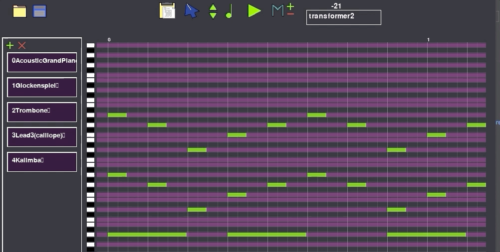

SpeedMusic
==========

A Pygame application for AI music composition. 

Features
1. Multi-track composition
2. Tranformer model for music generation
3. LSTM models are also included

Keys:
1. G    : Produce continuation of a give music
2. C    : Clear track
3. Space: Play&Pause
4. 1-6  : Select note duration

Note:
1. To Open a midi place it in document folder
2. Once you save, change the name of the file in the location 

Run Display.py for the application